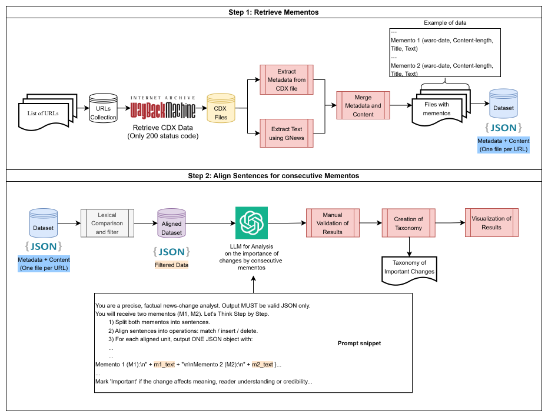

# ArchiveDiff-LLM: Detecting Important Changes in Archived Web Content
Pipeline for detecting and assessing important changes in archived web content. Implements ArchiveDiff-LLM from our JCDL 2025 paper, combining memento retrieval, sentence-level alignment, and LLM-based importance classification.

This repository contains the code and data accompanying the paper:

> **ArchiveDiff-LLM: Automating the Detection and Assessment of Important Changes in Archived Web Content**   
> Submitted to JCDL 2025.

---

## Overview

ArchiveDiff-LLM is a pipeline that leverages Large Language Models (LLMs) to automatically detect and assess important changes across archived versions (*mementos*) of web pages.  
Unlike traditional diff approaches, which operate at the character or token level, ArchiveDiff-LLM integrates:

- **Extraction of text in mementos from the Wayback Machine**
- **LLM-based classification of importance of content changes**

This repository provides:
- Dataset of archived news articles (CDX and extracted text)
- Code for memento retrieval, LLM analysis, metrics, and creation of charts
- Outputs of the experiment
- An interactive HTML viewer for exploring results
  
---

## 🧩 Methodology Overview

The research methodology follows a systematic pipeline:

